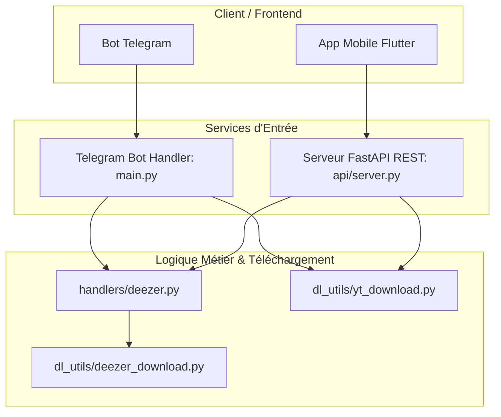

# Architecture et Améliorations du Backend (FastAPI / Telegram Bot)

Ce document décrit l'architecture du backend de **lkm-player** après l'implémentation de la refactorisation et des améliorations de robustesse et de fonctionnalités.

---

## 1. Vue d'ensemble de l'architecture finale

Le backend (`services/api`) est composé de deux interfaces d'accès unifiées qui partagent la même logique métier :

1. **Le Bot Telegram (`main.py`)** : Gère les interactions et messages via `aiogram`.
2. **L'API REST (`api/server.py`)** : Expose les services de téléchargement et de recherche via `FastAPI` (Uvicorn), utilisé par l'application mobile Flutter (`apps/mobile`).

### Schéma de l'architecture de téléchargement :

---

## 2. Améliorations Implémentées

Les cinq étapes du plan d'action de correction du backend ont été entièrement réalisées :

### 1. Extraction et centralisation du module YouTube/SoundCloud
* **Fichier créé** : [dl_utils/yt_download.py](file:///D:/PROJETS/lkm-player/services/api/dl_utils/yt_download.py)
* **Description** : Centralise toute la logique de téléchargement audio (`yt-dlp`), d'extraction de métadonnées, de recadrage des pochettes (images) et de tagging ID3 (`mutagen`).
* **Résultat** : La logique de téléchargement YouTube et SoundCloud est désormais 100 % indépendante du framework Telegram (`aiogram`) et réutilisable.
* **Mise à jour du bot** : Les gestionnaires de messages du bot dans [handlers/yt_dlp.py](file:///D:/PROJETS/lkm-player/services/api/handlers/yt_dlp.py) ont été simplifiés pour utiliser ce nouveau module.

### 2. Ajout de YouTube et SoundCloud dans l'API REST
* **Fichier modifié** : [api/server.py](file:///D:/PROJETS/lkm-player/services/api/api/server.py)
* **Nouveaux endpoints** :
  - `GET /api/search/youtube?q=...`
  - `GET /api/search/soundcloud?q=...`
  - `GET /api/download/youtube/{video_id}`
  - `GET /api/download/soundcloud?url=...`
* **Résultat** : L'application mobile Flutter peut maintenant rechercher et télécharger de l'audio depuis YouTube et SoundCloud en plus de Deezer.

### 3. Nettoyage Robuste et Sécurisé des Fichiers Temporaires
* **Mécanisme** : Remplacement des temporisateurs fragiles (`asyncio.sleep(10)`) par les `BackgroundTasks` natives de FastAPI.
* **Résultat** : Les fichiers temporaires (fichiers MP3 ou archives ZIP) sont supprimés du disque **immédiatement après** que le transfert HTTP avec le client est entièrement terminé. Cela évite les corruptions de fichiers sur les connexions lentes.
* **Démarrage du serveur** : Un gestionnaire d'événement `@app.on_event("startup")` vide automatiquement tout le contenu de `tmp/` à chaque démarrage de l'API.

### 4. Gestion de la Concurrence via Sémaphore
* **Mécanisme** : Remplacement du verrou global unique (`asyncio.Lock()`) par un sémaphore configurable (`asyncio.Semaphore(MAX_CONCURRENT_DOWNLOADS)`).
* **Résultat** : L'API peut désormais traiter jusqu'à 3 téléchargements concurrents par défaut (valeur ajustable dans le fichier [token.env](file:///D:/PROJETS/lkm-player/services/api/token.env) via `MAX_CONCURRENT_DOWNLOADS`). Les requêtes supplémentaires sont mises en file d'attente au lieu de bloquer l'API entière ou d'expirer.

### 5. Documentation Interactive OpenAPI / Swagger Enrichie
* **Description** : Les schémas de réponse ont été typés avec des modèles Pydantic et toutes les routes ont été enrichies de descriptions détaillées, de tags et de métadonnées de paramètres.
* **Accès** : La documentation Swagger complète est générée et interactive sur la route **`/docs`**.

### 6. Correction de la Configuration Locale
* **Fichiers créés** : 
  - Fichier exemple : [token.env.example](file:///D:/PROJETS/lkm-player/services/api/token.env.example)
  - Fichier de configuration local : [token.env](file:///D:/PROJETS/lkm-player/services/api/token.env)
* **Résultat** : Le script de démarrage local ne plante plus à cause d'un fichier absent.

### 7. Recherche Globale Unifiée Multi-Sources
* **Route créée** : `GET /api/search/global`
* **Description** : Recherche en parallèle sur Deezer (titres et albums), YouTube et SoundCloud.
* **Fonctionnalités** :
  - **Recherche globale (`source=all`)** : Retourne un aperçu limité (par défaut `limit=5` par source), idéal pour un premier affichage global dans l'application.
  - **Recherche ciblée (`source=deezer|youtube|soundcloud`)** : Effectue uniquement la recherche pour la source spécifiée afin de récupérer les résultats complets d'une source unique.
  - **Résilience** : Les appels réseau vers chaque service sont isolés. Si l'un des services échoue ou est mal configuré (ex: token Deezer manquant), le serveur continue et renvoie les résultats des autres sources au lieu de générer une erreur HTTP 500 globale.

---

## 3. Évolution Future : Pagination des Recherches

### Objectif
Permettre un défilement infini (infinite scroll) dans l'application mobile en remplaçant la limite fixe par des paramètres de pagination standard (`offset` et `limit`) sur toutes les routes de recherche (`/api/search`, `/api/search/youtube`, `/api/search/soundcloud`).

### Conception Technique

#### A. Recherche Deezer (Pagination Native)
Le paramètre `deezer_search` sera modifié pour accepter `offset` (index) et `limit`.
L'URL appelée sur l'API de Deezer passera de :
`https://api.deezer.com/search/{type}?q={query}`
à :
`https://api.deezer.com/search/{type}?q={query}&index={offset}&limit={limit}`

#### B. Recherche YouTube & SoundCloud (Pagination Simulée via `yt-dlp`)
Comme `yt-dlp` ne gère pas de paramètre d'offset pour les recherches textuelles, nous appliquerons une stratégie de découpage :
1. Calculer le nombre total de résultats à extraire : `max_results = offset + limit`.
2. Lancer la recherche `yt-dlp` pour extraire ces `max_results` (ex: `ytsearch30:query` pour `offset=15` et `limit=15`).
3. Découper la liste de résultats en Python : `results[offset : offset + limit]`.
4. Mettre en place un plafond de sécurité de `offset + limit <= 100` pour préserver le temps de réponse de l'API.

#### C. Paramètres d'API attendus
Toutes les routes de recherche accepteront désormais :
* `q: str` (Requis) : Requête textuelle.
* `offset: int` (Optionnel, défaut `0`) : Index du premier résultat.
* `limit: int` (Optionnel, défaut `20`) : Nombre de résultats à retourner.
